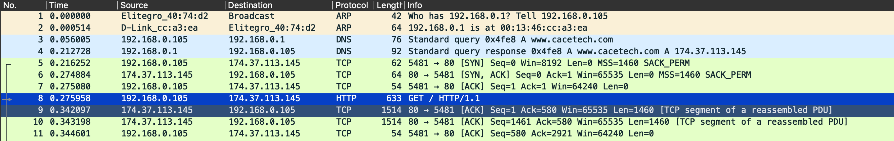
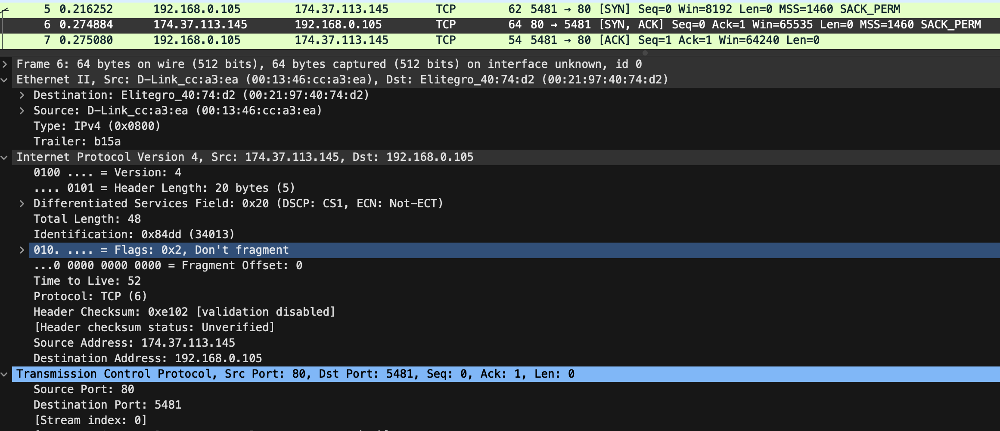

# TCP/IP 분석 개요

TCP/IP 통신은 사용하는 포트, ip 주소, 사용하는 경로 및 MAC 주소를 결정하기 위한 수많은 변환 프로세스가 있다.
표준 규칙을 따랴아한다.
프로세스 중 하나가 실패하는 경우 호스트는 다른 호스트와 통신할 수 없다.

## TCP/IP 계층

## TCP/IP 변환 프로세스 

1. 포트 번호 변환
2. 네트워크 도메인 변환
    2.1. 도메인에 대한 DNS resolver 캐시를 검색
    2.2. DNS resolver 캐시에 없을 경우, 호스트 파일 검사(/etc/hosts)
    2.3. 로컬 호스트 파일이 존재하지 않거나 요구된 이름/주소가 호스트 파일에 없는 경우, DNS 서버로 질의

3. 대상이 로컬일 때 라우터 결정

ex)
클라이언트 주소: 10.1.0.1/8
서버 주소: 10.2.99.99

서브넷마스크에 따라 달라짐

클라이언트 주소와 서버 주소 &(and) 연산

4. 로컬 MAC 주소 변환
4.1. ARP 캐시 조회
4.2. ARP 캐시에 없으면, ARP 브로드캐스트 검색
4.3. 검색된 MAC 주소로 통신

5. 경로 변환(대상이 원격일 때)
5.1. 로컬 라우팅 테이블 검색
5.2. 기본 게이트웨이에 패킷 전송
5.3. 게이트웨이가 목적지 라우터까지 경로 탐색 및 라우팅

6. 게이트웨이에 대한 로컬 MAC 주소 변환

## 시나리오 DNS 캐시

파일1 (캐시 X): http-riverbed-one.pcapng
파일2 (캐시 O): http-riverbed-two.pcapng

DNS 캐시 유무에 따른 웹사이트의 로딩 시간과 패킷 숫자의 차이 확인  

## 시나리오

파일: net-resolutions.pcapng
www.cacetech.com에 홈페이지 접속 시도

1. 클라이언트는 www.cacetech.com와 매칭되는 ip를 모르기 때문에 DNS 질의 시도
=> DNS 캐시나 호스트 파일에 없다는 뜻
2. DNS와 클라이언트 간 같은 네트워크이기에 ARP로 MAC 주소 확인
3. DNS 질의로 www.cacetech.com의 ip는 174.37.113.145로 확인
4. 질의된 정보를 바탕으로 TCP 연결 생성

- 전송 계층: 포트
- 인터넷 계층: ip
- 데이터링크 계층: mac

5. html 웹페이지 접속

