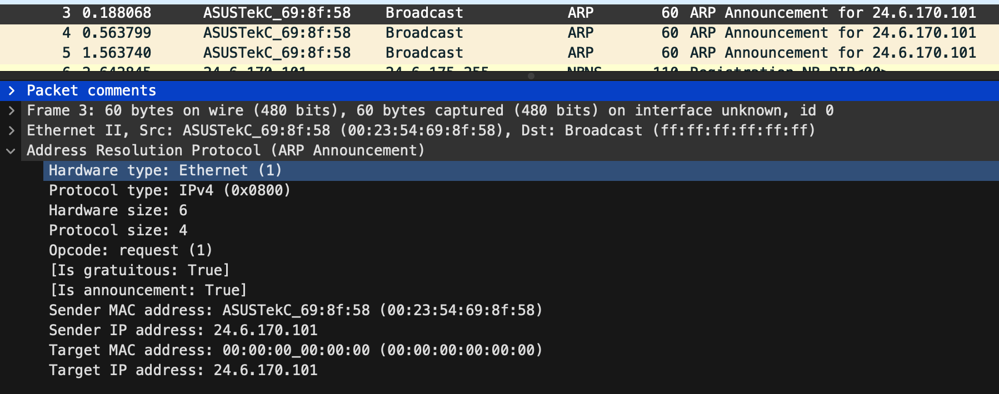
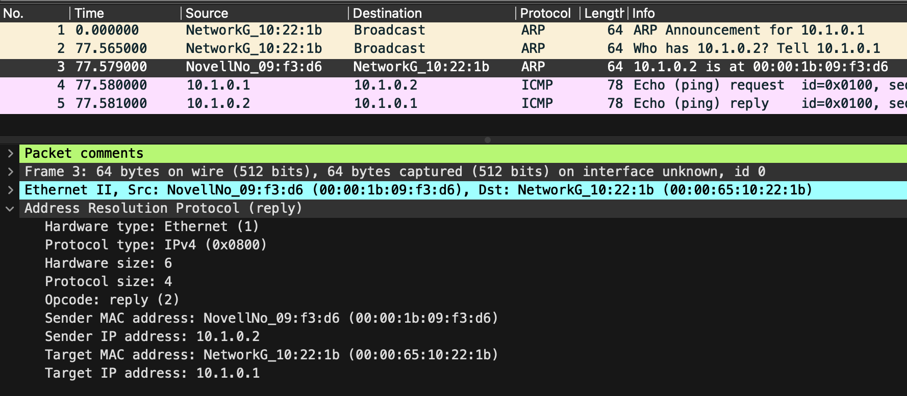

# ARP 트래픽 분석

대상 호스트나 게이트웨이/라우터의 MAC 주소를 얻기 위한 프로토콜

=> 로컬 네트워크에서 IP 주소와 물리 주소를 연관 짓고, IP 주소 중복을 테스트 하기 위해 이용

=> ARP 패킷은 IP 헤더가 없기 때문에 라우팅 되지 않음

ARP 요청하기 전에 ARP 캐시 검색 후, 부재 시 브로트케스트 요청

## 시나리오 - 컴퓨터 부팅 시

파일: arp-bootup.pacpng

컴퓨터 부팅 후, 24.6.170.101가 이미 다른 곳에 사용하고 있는지 (IP 주소 중복) 검사하기 위해 
쓸모없는 ARP 요청한다.

## 시나리오 - ping

파일: arp-ping.pacpng

ARP 요청으로 10.1.0.2 ip를 가진 MAC 주소 조회 후, 
ping(ICMP 패킷)을 요청

### Opcode

오피코드(Opcode)는 ARP가 요청/응답 패킷을 구분하기 위한 필드이다. 
=> ARP는 요청/응답 둘 다 같은 형식이기 때문

ARP가 IP 주소에서 MAC 주소를 얻게 한다면,
RARP는 MAC 주소로 IP 주소를 얻게 해주는 프로세스이다.

|Opcode|목적|
|-|-|
|1|ARP request|
|2|ARP reply|
|3|RARP request|
|4|RARP reply|

