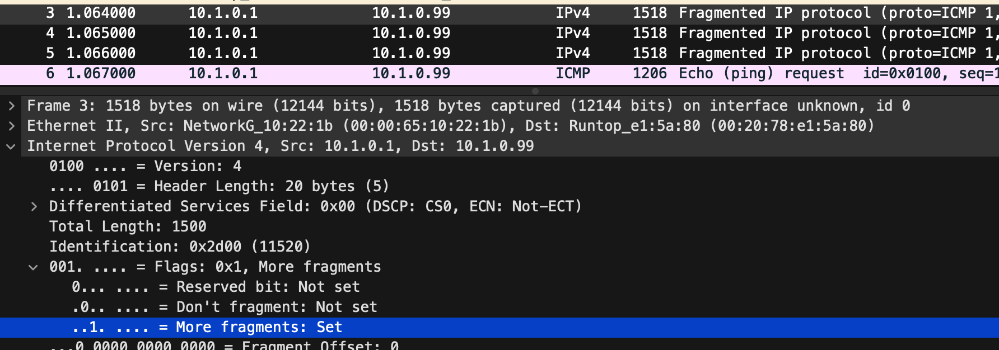
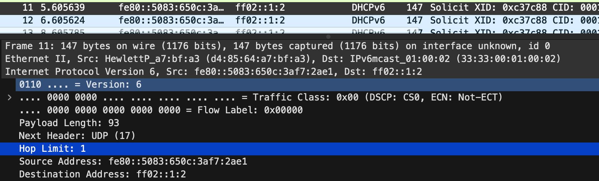

# 인터넷 프로토콜(IPv4/IPv6) 트래픽 분석

## 단편화

패킷을 송신하는데 한번에 송신할 수 있는 패킷 크기가 정해져 있어 나누어서 보냄

### 식별 필드

개별 IP 패킷 당, 전송했을 때 유일한 ID를 할당 받는다.

패킷이 단편화되는 경우 같은 ID 번호가 할당된다.

### MTU(Maximum Transmission Unit)

MTU이란 네트워크에 연결된 장치가 받아들일 수 있는 최대 데이터 패킷 크기
=> 라우터 장비마다 MTU가 다르기 때문에 패킷을 분할해서 송신하는데 `단편화`라 불림

### 플래그 필그

Bit 0: 예약됨(0으로 설정)
Bit 1: 단편화 비트가 아님(0=단편화, 1=단편화가 아님)
Bit 2: 더 단편화된 비트(0=마지막, 1=전송될 조각이 더 있음)

### 시나리오: ip 단편화

파일: ip-fragment.pcapng

- identification이 0x2d00으로 동일한 걸 볼 수 있다.
- 3,4,5에서 플래그 필그가 2로 활성화되 있고 마지막 ICMP 패킷에서 0으로 세팅된 걸 볼 수 있다.

## 패킷의 수명: TTL

패킷이 목적지를 못 찾을때 영원히 네트워크를 looping할 수는 없기에 TTL값을 둔다.

### TTL 필드 IPv4

라우터를 지날때마다 1씩 감소하며, 각각 OS마다 TTL 초기 값이 있으며, TTL 초기 값으로는 32, 60, 128 등이있다.

### Hop Limit 필드 IPv6

ipv6에서는 해당 값으로 TTL과 동일하게 본다.

### 시나리오: Hop

파일: ipv6-general.pcapng

## 패킷의 목적: 프로토콜

### 프로토콜 필드

해당 필드를 보고 인터넷계층까지인지 추가로 전송 계층까지 있는지 확인 가능

|번호|설명|
|-|-|
|1|ICMP|
|2|IGMP|
|6|TCP|
|8|EGP|
|9|Cisco의 IGRP 같은 사설 내부 게이트웨이|
|17|UDP|
|45|IDRP|
|88|Cisco EIGRP|
|89|OSPF|

